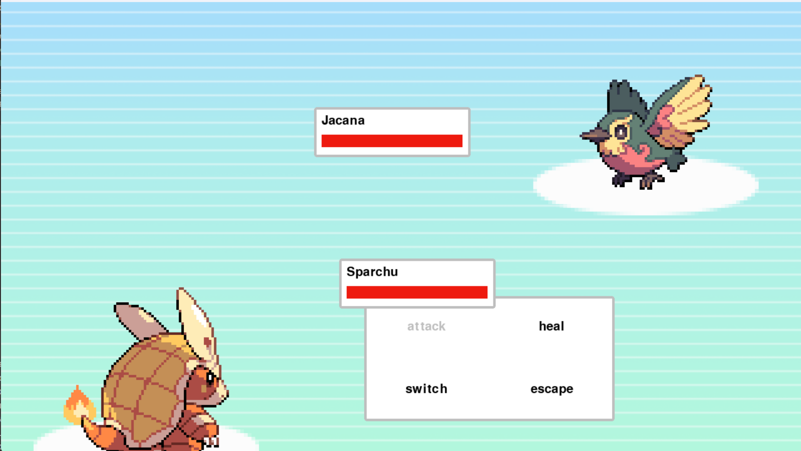
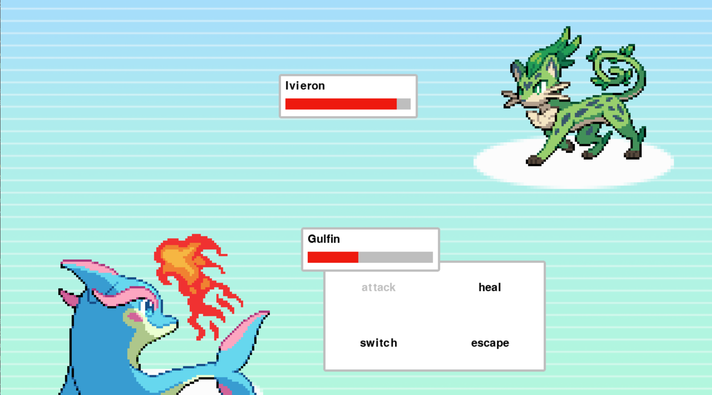

# Monster Battle

A turn-based monster battling RPG inspired by classic creature-collection games. Battle against random opponents, manage your team of monsters, and master elemental strengths and weaknesses.

## Features

- Turn-based combat system
- 15+ unique monsters across 3 elements (Fire, Water, Plant)
- Elemental advantage system (2x damage, 0.5x resistance)
- Team management with monster switching
- Healing mechanics to recover health during battle
- Animated attack effects with sound

## Screenshots



<br/>



## Controls

| Key | Action |
|-----|--------|
| ↑ / ↓ / ← / → | Navigate menus |
| Space | Select option |
| Escape | Return to previous menu |

## Gameplay

### Battle Options
- **Attack** - Choose from 4 abilities to damage the opponent
- **Heal** - Recover 50 HP for your active monster
- **Switch** - Swap to another alive monster from your team
- **Escape** - Quit the game

### Elemental System

| Attacker \ Defender | Fire | Water | Plant | Normal |
|---------------------|------|-------|-------|--------|
| Fire                | 1×   | 0.5×  | 2×    | 1×     |
| Water               | 2×   | 1×    | 0.5×  | 1×     |
| Plant               | 0.5× | 2×    | 1×    | 1×     |
| Normal              | 1×   | 1×    | 1×    | 1×     |

### Available Monsters

| Monster | Element | Base Health |
|---------|---------|-------------|
| Plumette | Plant | 90 |
| Ivieron | Plant | 140 |
| Pluma | Plant | 160 |
| Sparchu | Fire | 70 |
| Cindrill | Fire | 100 |
| Charmadillo | Fire | 120 |
| Finsta | Water | 50 |
| Gulfin | Water | 80 |
| Finiette | Water | 100 |
| Atrox | Fire | 50 |
| Pouch | Plant | 80 |
| Draem | Plant | 110 |
| Larvea | Plant | 40 |
| Cleaf | Plant | 90 |
| Jacana | Fire | 60 |
| Friolera | Water | 70 |

## Installation

1. Clone the repository:
```bash
git clone https://github.com/yourusername/monster-battle.git
cd monster-battle
```

2. Install dependencies:
```bash
pip install pygame
```

3. Run the game:
```bash
python main.py
```

## How to Play

1. You start with a team of 6 monsters
2. Each battle begins against a random opponent
3. Choose your action using the menu system
4. Attacks deal damage based on elemental matchups
5. When a monster's health reaches 0, you must switch to another
6. Defeat opponents to continue the streak
7. The game ends when all your monsters are defeated

## Asset Credits

All assets (sprites, sound effects, music) are from [insert credit source here]

## License

[MIT](LICENSE)
